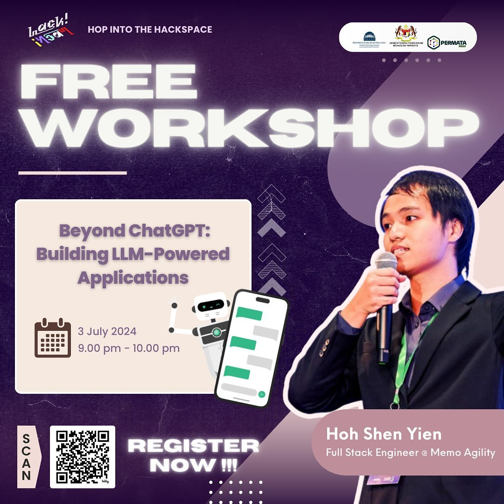

# Beyond ChatGPT: Building LLM-Powered Applications



This repository contains codes used from the [workshop](https://www.instagram.com/p/C8w4Q8uymD-/).

## Prerequisites

1. Python >= 3.9
   
   Download it [here](https://www.python.org/downloads/).

2. An editor, such as [VS Code](https://code.visualstudio.com/)

## Getting Started

1. Create a virtual environment & activate it

```bash
python -m venv .venv
source .venv/bin/activate
```

2. Install the requirements

```bash
pip install -r requirements.txt
pip install -q -U google-generativeai
```

3. Retrieve the API key from [Google AI Studio](https://aistudio.google.com/app/apikey) and replace it into `app.py`, 

```py
genai.configure(api_key="API_KEY")
```

4. Start the application

```bash
streamlit run app.py
```